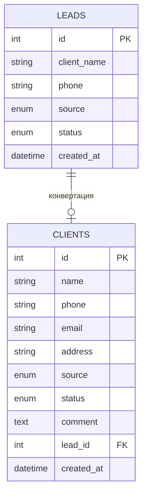

# Implementation Plan: Slice #2 — Модуль Клиентов (Конвертация Лида → Клиент)

## 1. Обоснование выбора темы среза

### Почему именно «Клиенты», а не «Проекты/Заказы»?

Согласно бизнес-логике из ТЗ (`docs/business_logic.md`), Модуль 2 описан как единый блок **«CRM / Лиды / Клиенты»**:

> *Функции: входящий лид → создание карточки клиента → контакты → история общения → ответственный менеджер → комментарии → задачи по клиенту.*

В Срезе №1 мы реализовали **первую половину** этого модуля — входящие заявки (Лиды). Логичный следующий шаг — **вторая половина**: конвертация Лида в полноценную карточку Клиента.

**Аргументы:**
1. **Бизнес-логика:** Лид без возможности стать Клиентом — тупик. Нет перехода дальше по воронке.
2. **Зависимость Модуля 3:** Проекты/Заказы по ТЗ привязываются к Клиенту, а не к Лиду. Без таблицы `clients` невозможно корректно реализовать заказы.
3. **Расширенные статусы:** ТЗ определяет 10 статусов сделки (от «новый запрос» до «архив»), из которых в Лидах мы использовали только 5. Остальные 5 (`предоплата`, `передан в производство`, `оплачен полностью`, `закрыт`, `архив`) относятся к фазе Клиента.
4. **Принцип Vertical Slice:** 1 таблица + 2 эндпоинта + UI-экран + сидирование = ровно один срез.

---

## 2. Предлагаемые изменения (Proposed Changes)

### 2.1. Слой базы данных (Database & ORM Layer)

#### [NEW] Перечисление `ClientStatus` в `backend/models.py`

Расширенный набор статусов клиента/сделки из ТЗ. Первые 5 статусов совпадают с `LeadStatus` (воронка продолжается), плюс добавляются 5 новых:

```python
class ClientStatus(str, enum.Enum):
    NEW = "новый запрос"
    CALCULATION = "просчет / КП"
    SENT = "КП отправлено"
    AGREEMENT = "согласование"
    PREPAYMENT = "предоплата"              # НОВЫЙ
    IN_PRODUCTION = "передан в производство" # НОВЫЙ
    PAID = "оплачен полностью"             # НОВЫЙ
    CLOSED = "закрыт"                       # НОВЫЙ
    REJECTION = "отказ"
    ARCHIVE = "архив"                       # НОВЫЙ
```

#### [NEW] Модель SQLAlchemy `Client` в `backend/models.py`

| Поле | Тип | Описание |
|------|-----|----------|
| `id` | Integer, PK, autoincrement | Идентификатор |
| `name` | String, NOT NULL | Полное имя / название организации |
| `phone` | String, NOT NULL | Основной телефон |
| `email` | String, nullable | Email (опционально) |
| `address` | String, nullable | Адрес (опционально, пригодится для доставки/монтажа) |
| `source` | Enum(LeadSource), NOT NULL | Источник заявки (переносится из лида) |
| `status` | Enum(ClientStatus), NOT NULL, default=AGREEMENT | Текущий статус сделки |
| `comment` | Text, nullable | Комментарий менеджера |
| `lead_id` | Integer, ForeignKey("leads.id"), nullable, unique | Связь с исходным лидом (1:1) |
| `created_at` | DateTime, default=now(UTC) | Дата создания карточки |

> **Связь Lead → Client:** Один Лид может быть конвертирован ровно в одного Клиента (`unique=True` на `lead_id`). При этом `lead_id` — nullable, чтобы можно было создать клиента вручную, без исходного лида.

### 2.2. Слой валидации API (Pydantic Schemas)

#### [MODIFY] `backend/schemas.py`

Добавить новые схемы:

```python
# --- Клиенты ---
class ClientBase(BaseModel):
    name: str
    phone: str
    email: str | None = None
    address: str | None = None
    source: LeadSource
    status: ClientStatus = ClientStatus.AGREEMENT
    comment: str | None = None

class ClientCreate(BaseModel):
    """Создание клиента из лида — достаточно передать lead_id и опциональные поля"""
    lead_id: int
    email: str | None = None
    address: str | None = None
    comment: str | None = None

class ClientCreateManual(ClientBase):
    """Создание клиента вручную (без лида)"""
    pass

class ClientResponse(ClientBase):
    id: int
    lead_id: int | None
    created_at: datetime

    model_config = ConfigDict(from_attributes=True)
```

### 2.3. Слой API Эндпоинтов (FastAPI Routing)

#### [MODIFY] `backend/main.py`

##### Эндпоинт `POST /api/clients` — Конвертация Лида в Клиента

Бизнес-логика:
1. Принимает `ClientCreate` (содержит `lead_id` + опциональные доп. поля).
2. Находит Лид по `lead_id` → если не найден, возвращает `404`.
3. Проверяет, что Лид ещё не конвертирован (нет записи в `clients` с таким `lead_id`) → если уже есть, возвращает `409 Conflict`.
4. Создаёт запись `Client`, перенося `name`, `phone`, `source` из лида.
5. **Обновляет статус лида** на `LeadStatus.AGREEMENT` (или сохраняет текущий, если он уже дальше по воронке).
6. Возвращает `ClientResponse`.

```
POST /api/clients
Body: { "lead_id": 1, "email": "ivan@mail.ru", "address": "ул. Пушкина, 10" }
→ 201 Created: { "id": 1, "name": "Иван Петров", ... }
```

##### Эндпоинт `GET /api/clients` — Список клиентов (Директор)

1. Проверка заглушки роли `CURRENT_ROLE == "DIRECTOR"` → иначе `403`.
2. Возвращает все записи из таблицы `clients`, отсортированные по `id DESC`.
3. Возвращает `List[ClientResponse]`.

```
GET /api/clients
→ 200 OK: [ { "id": 2, ... }, { "id": 1, ... } ]
```

### 2.4. Скрипт наполнения тестовыми данными

#### [NEW] `backend/seed_clients.py`

Создать скрипт, который:
1. **Зависит от `seed.py`** — предполагает, что лиды уже существуют в БД.
2. Конвертирует 2 из 4 тестовых лидов в клиентов (имитация реальной воронки, где не все лиды конвертируются).
3. Создаёт 1 клиента вручную (без лида) — демонстрация ручного ввода.

Тестовые данные:

| Клиент | Источник | Лид | Статус |
|--------|----------|-----|--------|
| Анна Смирнова | звонок | Лид #2 | согласование |
| ИП Сидоров | WhatsApp | Лид #3 | предоплата |
| ООО "Дубовый мир" | вручную внесено | — | просчет / КП |

### 2.5. Слой визуализации (Frontend UI)

#### [MODIFY] `frontend/index.html`

По аналогии с существующей таблицей Лидов (Срез №1), добавить новую секцию **«Carpenter CRM - Срез №2 (Модуль Клиентов)»** ниже таблицы Лидов.

##### Структура секции:

1. **Заголовок:** `Carpenter CRM - Срез №2 (Модуль Клиентов)`
2. **Подзаголовок:** «Карточки клиентов, конвертированных из лидов. Данные из БД PostgreSQL.»
3. **Кнопка действия:** `«+ Конвертировать лид»` — открывает inline-строку с полем выбора лида для конвертации.

##### Таблица клиентов — колонки:

| Колонка | Описание |
|---------|----------|
| ID | `#N` — серый, как в таблице лидов |
| Имя клиента | `name`, жирный шрифт |
| Телефон | `phone` |
| Email | `email` (или `—` если пусто) |
| Источник | Бейдж `badge-source` (переиспользуем стили из Лидов) |
| Статус | Цветной бейдж — расширенная палитра для 10 статусов |
| Из лида | `#lead_id` или `вручную` если lead_id = null |
| Дата создания | Формат `dd.mm.yyyy, HH:MM` |
| Действия | Кнопка удаления (иконка корзины) |

##### Новые CSS-стили для статусов клиента:

Переиспользуем существующие 5 стилей из Лидов + добавляем 5 новых:

```css
/* Статусы, унаследованные от Лидов (уже есть) */
.badge-status-new         /* синий   — новый запрос */
.badge-status-calculation  /* оранжевый — просчет / КП */
.badge-status-sent         /* зелёный  — КП отправлено */
.badge-status-agreement    /* фиолетовый — согласование */
.badge-status-rejection    /* красный  — отказ */

/* НОВЫЕ статусы клиента */
.badge-status-prepayment     { background-color: #e0f2f1; color: #00695c; border: 1px solid #b2dfdb; }  /* бирюзовый — предоплата */
.badge-status-in-production  { background-color: #fff8e1; color: #f9a825; border: 1px solid #fff59d; }  /* жёлтый — передан в производство */
.badge-status-paid           { background-color: #e8f5e9; color: #2e7d32; border: 1px solid #a5d6a7; }  /* насыщ. зелёный — оплачен полностью */
.badge-status-closed         { background-color: #eceff1; color: #546e7a; border: 1px solid #cfd8dc; }  /* серый — закрыт */
.badge-status-archive        { background-color: #f5f5f5; color: #9e9e9e; border: 1px solid #e0e0e0; }  /* светло-серый — архив */
```

##### JavaScript-функции:

| Функция | Описание |
|---------|----------|
| `fetchClients()` | GET `/api/clients` → рендер таблицы с бейджами |
| `convertLeadRow()` | Добавляет inline-строку с полем `lead_id`, полями `email`, `address`, `comment` и кнопкой «Конвертировать» |
| `saveClient(btn)` | POST `/api/clients` → конвертация лида, обновление строки, обновление таблицы лидов |
| `deleteClient(id, btn)` | DELETE `/api/clients/{id}` → удаление строки с подтверждением |

##### Взаимодействие с таблицей Лидов:

После успешной конвертации лида в клиента — вызывается `fetchLeads()` для обновления таблицы лидов (визуально видно, что статус лида изменился).

---

## 3. Что НЕ входит в этот срез

| Компонент | Причина исключения |
|-----------|-------------------|
| PUT/PATCH эндпоинт (редактирование клиента) | Будет добавлен позже, минимальный срез |
| История общения / комментарии (как отдельная сущность) | Модуль 5 (Чат/Комментарии) |
| Задачи по клиенту | Модуль 4 (Задачник) |
| Ответственный менеджер | Требует модуля авторизации (заморожен до Среза №3+) |

---

## 4. Затронутые файлы

| Файл | Действие | Описание |
|------|----------|----------|
| `backend/models.py` | MODIFY | + `ClientStatus` enum, + `Client` model, + `import ForeignKey, Text` |
| `backend/schemas.py` | MODIFY | + `ClientCreate`, `ClientCreateManual`, `ClientResponse` |
| `backend/main.py` | MODIFY | + `POST /api/clients`, + `GET /api/clients`, + `DELETE /api/clients/{id}` |
| `backend/seed_clients.py` | NEW | Скрипт сидирования клиентов |
| `frontend/index.html` | MODIFY | + Секция таблицы клиентов, + CSS-стили новых статусов, + JS-функции (CRUD) |

---

## 5. План верификации (Verification Plan)

### 5.1. Создание таблицы

Убедиться, что при старте сервера таблица `clients` создаётся автоматически (через `Base.metadata.create_all`).

Проверить в БД:
```powershell
powershell -c "docker exec -it carpenter_crm_db psql -U admin -d carpenter_db -c '\dt clients'"
```

### 5.2. Сидирование

```powershell
powershell -c ".\.venv\Scripts\python.exe backend/seed_clients.py"
```

*Критерий успеха:* В таблице `clients` появляется 3 записи (2 из лидов + 1 ручная).

### 5.3. Проверка через Swagger UI

1. Запустить сервер: `powershell -c ".\.venv\Scripts\python.exe -m uvicorn backend.main:app --reload"`
2. Открыть `http://localhost:8000/docs`

**Тест-кейсы (API):**

| # | Действие | Ожидаемый результат |
|---|----------|-------------------|
| 1 | `GET /api/clients` | 200 OK, массив из 3 клиентов |
| 2 | `POST /api/clients` с `{"lead_id": 1}` | 201 Created, клиент создан из лида "Иван Петров" |
| 3 | `POST /api/clients` с `{"lead_id": 1}` (повторно) | 409 Conflict — лид уже конвертирован |
| 4 | `POST /api/clients` с `{"lead_id": 999}` | 404 Not Found — лид не существует |
| 5 | `GET /api/clients` (после тестов) | 200 OK, массив из 4 клиентов |

### 5.4. Проверка UI (Визуализация)

1. Открыть `http://localhost:8000/` (корневая страница)
2. Прокрутить ниже таблицы Лидов

**Тест-кейсы (UI):**

| # | Действие | Ожидаемый результат |
|---|----------|-------------------|
| 1 | Загрузка страницы | Таблица клиентов отображает 3 записи с корректными бейджами статусов |
| 2 | Нажать «+ Конвертировать лид» | Появляется inline-строка с полем lead_id и доп. полями |
| 3 | Ввести lead_id = 1, нажать «Конвертировать» | Строка превращается в карточку клиента, таблица лидов обновляется |
| 4 | Повторная конвертация того же лида | Сообщение об ошибке (409 Conflict) |
| 5 | Нажать иконку удаления на клиенте | Confirm-диалог → удаление → строка исчезает |
| 6 | Проверить бейджи статусов | 10 статусов отображаются в разных цветах (бирюзовый, жёлтый, серый и т.д.) |

---

## 6. Диаграмма связей после Среза №2



> После утверждения плана — приступаю к написанию кода. Жду ваше решение! 🪵
