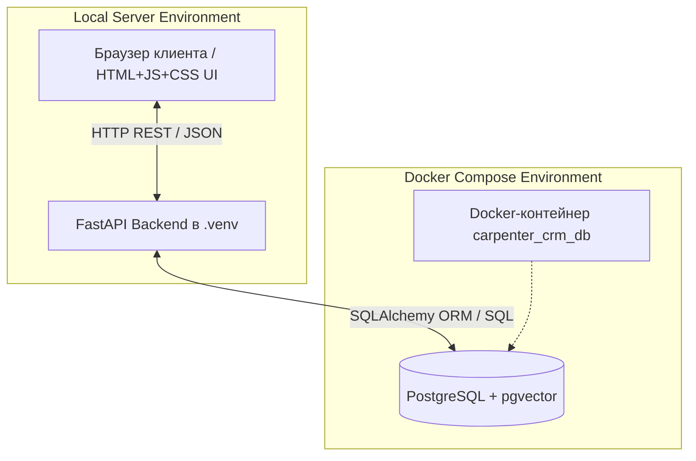
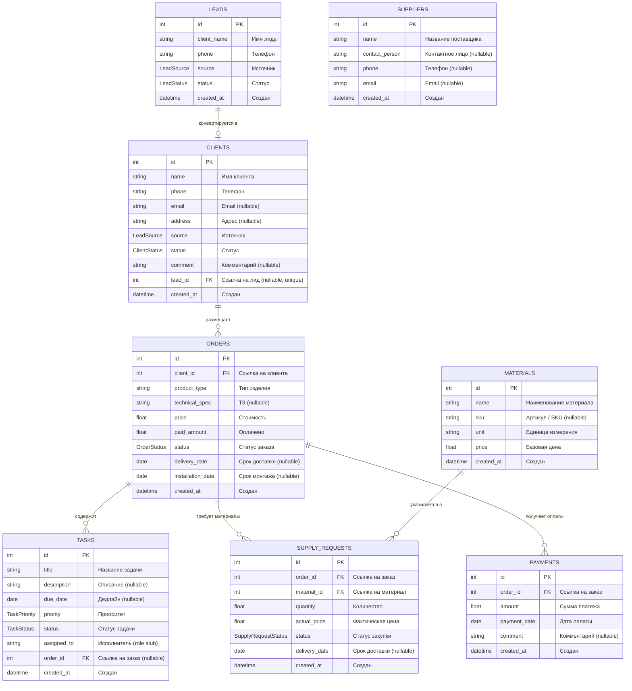

# Описание архитектуры Carpenter CRM

В данном документе приведено описание общей архитектуры системы, архитектурная схема взаимодействия компонентов, ER-диаграмма базы данных и первоисточники архитектурных решений проекта.

---

## 1. Общее описание архитектуры проекта

Carpenter CRM спроектирована как локальная монолитная веб-система с разделением на независимый API-бэкенд и статический фронтенд. Система разрабатывается по методологии **Vertical Slices (Вертикальные срезы)**: каждая фича (срез) внедряется сквозным образом — от таблицы в базе данных и эндпоинтов до интерфейсного представления.

### Ключевые компоненты:
1.  **Frontend Layer (Клиентская часть):**
    *   Представлена в виде статического HTML/JS/CSS приложения в одном файле [index.html](file:///c:/My-Code-Factory/Antigravity/Carpenter-CRM/frontend/index.html).
    *   Общается с бэкендом по протоколу HTTP REST с использованием JSON.
    *   Не содержит сборщиков пакетов (Vite, Webpack), что минимизирует накладные расходы на инфраструктуру на этапе MVP.
2.  **Backend Layer (Серверная часть):**
    *   Реализована на Python с использованием фреймворка **FastAPI**.
    *   Запускается через ASGI-сервер **Uvicorn**.
    *   Обеспечивает валидацию входящих и исходящих данных с помощью моделей **Pydantic** (в [schemas.py](file:///c:/My-Code-Factory/Antigravity/Carpenter-CRM/backend/schemas.py)).
    *   Использует **SQLAlchemy ORM** для работы с данными в объектно-ориентированном стиле.
3.  **Database Layer (Слой данных):**
    *   **PostgreSQL** — реляционная СУБД, запущенная локально в Docker-контейнере.
    *   **pgvector** — расширение PostgreSQL для работы с векторными эмбеддингами. Оно предустановлено в Docker-образе (`ankane/pgvector`) и предназначено для последующей интеграции AI-агентов и семантического поиска (RAG-архитектура).

---

## 2. Диаграмма архитектурного решения (Mermaid)

Ниже представлена схема взаимодействия компонентов приложения:

---

## 3. ER-диаграмма базы данных (Entity-Relationship)

> [!NOTE]
> Вы абсолютно верно указали название. **ER-диаграмма** (Entity-Relationship diagram, или диаграмма «сущность-связь») — это общепринятый стандарт в программной инженерии для визуализации структуры базы данных, таблиц, их атрибутов и связей между ними.

Ниже представлена актуальная ER-диаграмма базы данных Carpenter CRM на момент реализации Среза №6:

---

## 4. Первоисточники архитектурных решений

Для понимания того, почему система спроектирована именно так, выделим ключевые концептуальные первоисточники:

1.  **Концепция Вертикальных Срезов (Vertical Slices):**
    *   *Суть:* Вместо построения горизонтальных слоев приложения (сначала вся база данных, затем все контроллеры, затем весь UI) система собирается функциональными блоками (срезами). Например, срез оплат содержит одну таблицу, 3 эндпоинта и одну форму.
    *   *Источник:* Описан в регламенте [infra_standard.md](file:///c:/My-Code-Factory/Antigravity/Carpenter-CRM/docs/infra_standard.md) (Часть 4). Позволяет быстро тестировать рабочие куски системы без оверинжиниринга.
2.  **Спецификация Бизнес-Логики (`docs/business_logic.md`):**
    *   *Суть:* Главный документ требований, описывающий 10 основных модулей CRM (каталог, лиды, заказы, задачи, снабжение, финансы и т.д.).
    *   *Источник:* [business_logic.md](file:///c:/My-Code-Factory/Antigravity/Carpenter-CRM/docs/business_logic.md). Отражает реальные процессы столярного производства компании, гибридный характер бизнеса (серийное производство + индивидуальные проекты) и требования к AI-ready архитектуре.
3.  **Архитектурный шаблон REST API (FastAPI + Pydantic):**
    *   *Суть:* Бэкенд является чистым stateless-сервисом, который общается с клиентом посредством JSON. Валидация строго отделена от моделей базы данных (Pydantic схемы vs SQLAlchemy ORM модели).
    *   *Источник:* Документация FastAPI и лучшие практики разработки REST-сервисов на Python.
4.  **AI-Ready Layer (pgvector + Vertex AI):**
    *   *Суть:* Векторное расширение в СУБД для хранения эмбеддингов документов и базы знаний. Архитектурное решение закладывает базу для локального RAG (Retrieval-Augmented Generation) без необходимости перестраивать хранилище данных при внедрении AI-агентов.
    *   *Источник:* Раздел "AI-Ready Layer" в [infra_standard.md](file:///c:/My-Code-Factory/Antigravity/Carpenter-CRM/docs/infra_standard.md) (Часть 2).
